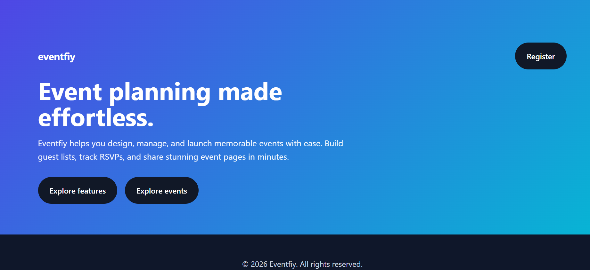
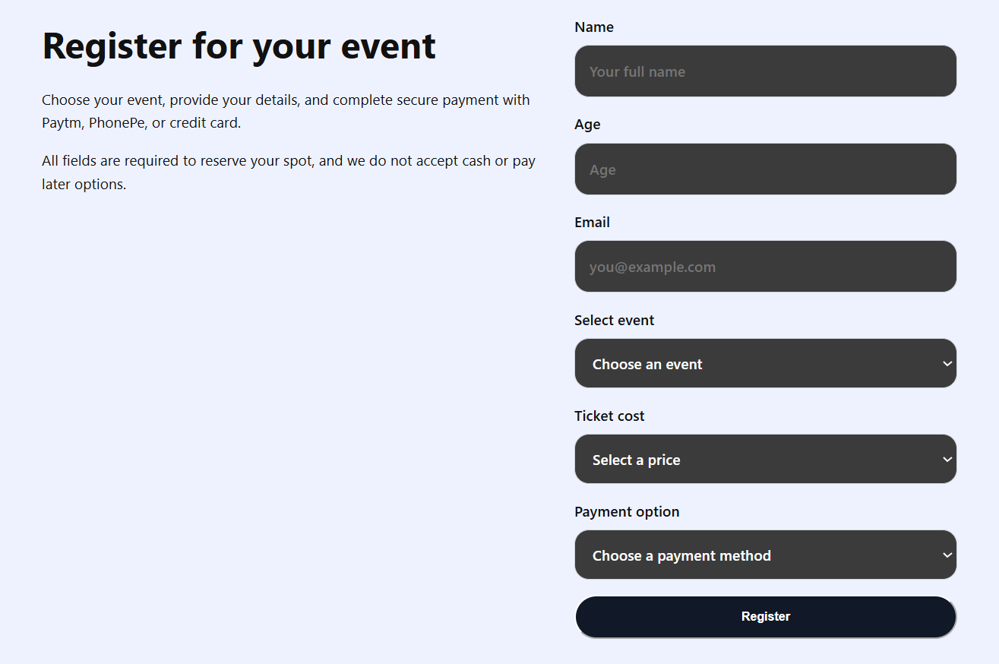

<div align="center">

<h1>🚀 TheCodeFleet</h1>

<h3>Modern Event Management Website</h3>

</div>

<div align="center">


[](https://thecodefleet.netlify.app/)


</div>

---

## Overview

TheCodeFleet is a frontend web project focused on delivering a clean design, responsive layouts, and an engaging user experience. Built with HTML, CSS, and JavaScript, it includes a working contact form powered by EmailJS and is deployed on Netlify for fast, reliable hosting.

## Features

* Responsive design for all screen sizes
* Modern and minimal user interface
* Interactive components using JavaScript
* Contact form with EmailJS integration
* Fast deployment through Netlify
* Clean and maintainable code structure

## Tech Stack

| Technology | Purpose                      |
| ---------- | ---------------------------- |
| HTML5      | Website Structure            |
| CSS3       | Styling & Responsive Layout  |
| JavaScript | Functionality & Interactions |
| EmailJS    | Contact Form                 |
| Netlify    | Deployment & Hosting         |

## Live Preview

Visit the website here:

**https://thecodefleet.netlify.app/**

## Local Setup

Clone the repository

```bash id="n84q1h"
git clone https://github.com/your-username/thecodefleet.git
```

Navigate into the project folder and open `index.html` in your preferred browser.

## Why This Project?

TheCodeFleet was built to practice modern frontend development by focusing on responsive design, clean layouts, and real-world integrations without relying on a backend.

## 📖 About The Project

TheCodeFleet is a modern **event management website** designed to showcase event planning services through a clean, responsive, and interactive user interface. The platform allows visitors to explore services, learn about the team, browse event offerings, and get in touch through a fully functional contact form powered by EmailJS.

Built with **HTML**, **CSS**, and **JavaScript**, the project focuses on delivering a seamless user experience across all devices while maintaining a fast and visually appealing design. The website is deployed on **Netlify** for reliable and efficient hosting.

### ✨ Key Features

* 🎉 Modern event management landing page
* 📱 Fully responsive across all devices
* ⚡ Interactive UI powered by JavaScript
* 📧 Contact form integrated with EmailJS
* 🎨 Clean and professional design
* 🚀 Hosted on Netlify
* 🤖 Developed with AI-assisted workflow

## 📸 Preview

### Home Page


### Registration Form


## 🤖 AI-Assisted Development

This project was developed using a combination of my own development skills and AI-assisted tools. AI was used throughout the development process to help with brainstorming, debugging, code generation, UI improvements, and problem-solving, while I guided the overall design, implementation, customization, and deployment.

This project reflects my ability to effectively leverage AI as a development partner to build modern web applications efficiently.


## Future Plans

* Improve animations
* Add more interactive sections
* Enhance SEO
* Optimize performance
* Expand with additional pages and features

---
# 📬 Connect With Me


- 💼 **LinkedIn:** https://www.linkedin.com/in/abhay-giri-852529311
- 💻 **GitHub:** https://github.com/abhay762006---


<div align="center">

### Thanks for visiting! ⭐

If you found this project interesting, consider giving it a star.

Made with ❤️ by **Abhay**
From idea to website — powered by AI.

</div>
